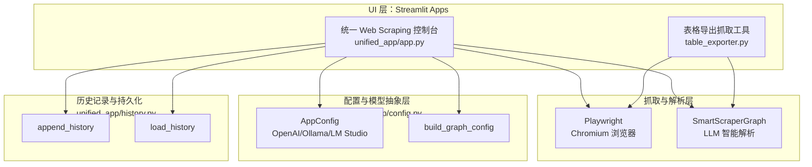
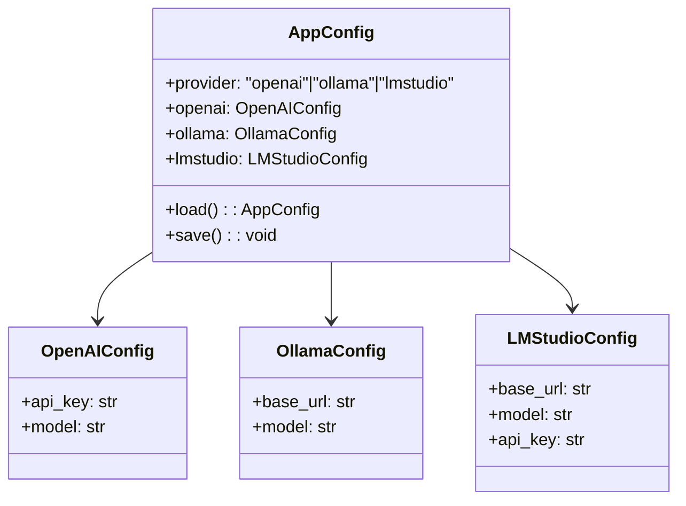
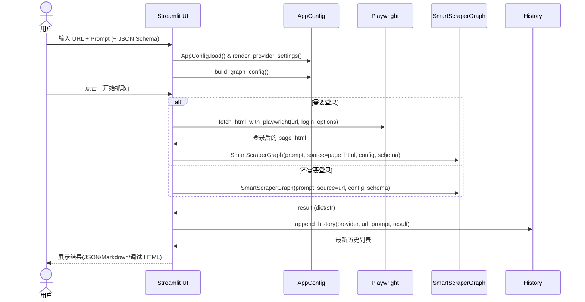
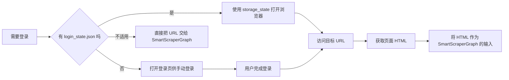
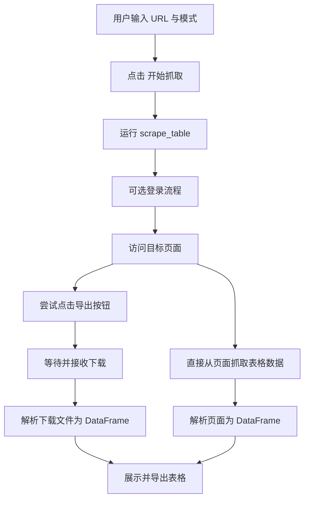

## AI 自动抓取网页实现原理

---

## 目录

- [AI 自动抓取网页实现原理](#ai-自动抓取网页实现原理)
- [目录](#目录)
- [整体架构概览](#整体架构概览)
- [配置与模型抽象：统一管理多家 LLM 厂商](#配置与模型抽象统一管理多家-llm-厂商)
  - [AppConfig：统一入口](#appconfig统一入口)
  - [build\_graph\_config：把差异收敛到一处](#build_graph_config把差异收敛到一处)
- [统一 Scraping 流程：从 URL + Prompt 到结构化结果](#统一-scraping-流程从-url--prompt-到结构化结果)
- [登录态与动态页面：为什么需要 Playwright](#登录态与动态页面为什么需要-playwright)
- [历史记录与可观测性](#历史记录与可观测性)
- [表格导出抓取工具的专用流程](#表格导出抓取工具的专用流程)
  - [两种模式](#两种模式)
- [与传统爬虫的对比与适用场景](#与传统爬虫的对比与适用场景)
- [总结](#总结)

---

## 整体架构概览

从代码结构上看，这个项目可以拆成 4 个核心层次：

- **UI 层（Streamlit）**：`unified_app/app.py`、`table_exporter.py`  
- **配置与 LLM 抽象层**：`unified_app/config.py`  
- **抓取与解析层**：`scrapegraphai.SmartScraperGraph` + Playwright  
- **持久化与历史层**：`unified_app/history.py` + 本地 JSON 文件

用一张 Mermaid 架构图来描述整体组件关系：

**核心理念**：  
在一个统一 UI 里，用户只需要：

- 选一个「模型提供商」（OpenAI / Ollama / LM Studio）
- 配好 API Key 或 Base URL
- 输入「URL + 抓取需求的自然语言描述」

后面的「加载网页」「登录」「解析 HTML」「让 LLM 理解页面并结构化输出」「记录历史」都由系统自动完成。

---

## 配置与模型抽象：统一管理多家 LLM 厂商

统一多家 LLM 厂商的关键在 `unified_app/config.py`。代码里使用了 `dataclass` 把不同厂商的配置建模为统一对象：

- `OpenAIConfig`
- `OllamaConfig`
- `LMStudioConfig`
- `AppConfig`：顶层配置（包含当前选用的 `provider` 和三个子配置）

### AppConfig：统一入口

`AppConfig` 做了两件事：

- **持久化**：使用 `unified_config.json` 保存所有配置，`load()` / `save()` 即可读写；
- **容错**：`load()` 时对字段做「默认值 + 覆盖」，避免因字段新增导致老配置崩溃。

### build_graph_config：把差异收敛到一处

`SmartScraperGraph` 只认识一种统一的 `config` 结构，因此各种 LLM 厂商的差异都通过 `build_graph_config(app_cfg)` 这一层来做「翻译」：

- **OpenAI**：`model_provider = "openai" + api_key + model`
- **Ollama**：`model_provider = "ollama" + model + base_url + embeddings`
- **LM Studio**：对外暴露 OpenAI 兼容接口，因此在 ScrapeGraph 视角下仍然是 `model_provider = "openai"`，但 `base_url` 指向 LM Studio。

这样的好处是：  
UI 层只关心「当前选用的是 provider='openai' 还是 'ollama'」，而不需要知道底层调用细节。

---

## 统一 Scraping 流程：从 URL + Prompt 到结构化结果

统一应用的主入口是 `unified_app/app.py` 里的 `main()` 函数。工作流可以概括为：

1. 载入配置 & 渲染侧边栏（模型厂商配置 + 历史记录）
2. 用户输入：
   - 目标 URL
   - 抓取 Prompt（自然语言）
   - 可选 JSON Schema（想要什么结构的 JSON）
3. 根据用户的高级选项，构造 ScrapeGraph 的 `loader_kwargs`
4. 点击「开始抓取」按钮后：
   - 可选：如果需要登录 → 先用 Playwright 获取登录后的 HTML
   - 根据是否有登录态 HTML，决定 `SmartScraperGraph` 的 `source` 是 URL 还是 HTML 字符串
   - 执行 `graph.run()` 获取结果
   - 写入历史记录并在前端展示

用一个简化的 Mermaid 时序图描述这个过程：

**关键设计点**：

- `source` 参数既可以是 URL，也可以是已经登录后的 HTML 字符串；
- JSON Schema 是完全可选的，但提供时可以大幅提高输出的「可用度」；
- 页面过大时会自动截断 HTML，以避免超出 LLM 上下文长度。

---

## 登录态与动态页面：为什么需要 Playwright

很多现实场景中，目标页面都需要登录才能访问，例如：

- SaaS 后台报表
- 内网管理系统
- GitHub 私有仓库等

**问题**：ScrapeGraph 自己不会「点登录」「输密码」「过验证码」。  
**解决方案**：在 ScrapeGraph 之前插入一层 Playwright 流程：

1. 启动 Chromium 浏览器；
2. 访问登录页（或目标页）；
3. 用户可选择：
   - 手动登录（打开真实浏览器窗口，自己操作）；
   - 利用已保存的 `login_state.json` 自动登录；
4. 登录成功后，获取当前页面 HTML 并返回给上层；
5. 把 HTML 作为 `SmartScraperGraph` 的 `source` 输入。

登录流程的简化示意（已重写为更简单、稳定的 Mermaid 语法）：

工程上还有一些容错设计：

- 读取 `login_state.json` 时会检查是否为空 / JSON 损坏，异常则自动删除并忽略；
- 对 Playwright 的超时有兜底策略（`networkidle` 超时时会退回到 `domcontentloaded`）。

---

## 历史记录与可观测性

`unified_app/history.py` 提供了一个非常轻量的历史系统：

- 使用 `HistoryItem` 数据类描述每条记录：
  - 时间戳
  - 使用的 provider（openai / ollama / lmstudio）
  - URL
  - Prompt
  - Result 摘要（自动从结果中截取前 200 字）
- 使用 `scrape_history.json` 保存最近 N 条（`MAX_HISTORY = 200`）。

侧边栏通过 `render_history()` 把这些历史渲染出来，点击可以看到：

- 本次抓取的 URL、Prompt；
- 自动生成的结果摘要（方便快速回忆）。

这一层虽然简单，但在调试与实际使用时提升很明显：

- 方便回溯「当时用的是什么 Prompt / 配置」；
- 可以用来构建后续的「二次分析」功能（例如对历史结果做对比等）。

---

## 表格导出抓取工具的专用流程

`table_exporter.py` 是另一个独立入口，专门用来解决「网页上有导出按钮，点击后下载表格」这种高频需求。

### 两种模式

1. **点击导出按钮模式**：
   - 输入 URL + 「导出按钮的描述」（如“导出表格”、“Export CSV”）；
   - Playwright 自动查找匹配按钮（按文本、属性、多种选择器兜底）并点击；
   - 使用 `page.expect_download()` 等待浏览器下载文件；
   - 使用 pandas 自动解析 CSV / Excel / JSON / TSV 为 DataFrame；
   - 在前端展示预览，并提供 CSV / Excel / JSON 三种格式的下载。

2. **抓取页面数据模式**：
   - 不依赖导出按钮，而是直接从 DOM 解析：
     - 优先解析 `<table>` → DataFrame；
     - 对 GitHub 仓库列表做了专门优化（先在浏览器内用 JS 组装结构化 JSON，再转 DataFrame）；
     - 如果没有表格，则退回到 `<ul>/<ol>`、链接列表等通用结构提取。

整体流程图（已重写为更简单的节点序列以提高渲染兼容性）：

这里完全没有用 LLM，而是传统工程手段：

- Playwright 负责「模拟人」去点按钮 / 打开页面；
- BeautifulSoup + pandas 负责「解析 HTML/文件 → DataFrame」；
- Streamlit 负责可视化与导出。

---

## 与传统爬虫的对比与适用场景

**统一 Web Scraping AI Agent** 的设计并不是要「替代所有传统爬虫」，而是解决一类新的、典型的需求：

- 目标网站结构复杂，经常改版；
- 需要理解文本语义，而不仅仅是 DOM 位置；
- 希望用「自然语言」描述抓取需求，而不是写 CSS/XPath。

简单对比：

| 维度 | 传统爬虫 | 本项目的 AI Scraping |
|------|----------|----------------------|
| 选择器 | 必须写 CSS/XPath | 用自然语言 Prompt |
| 结构变动 | 很敏感，易崩 | LLM 具备一定鲁棒性 |
| 语义理解 | 几乎没有 | 能理解上下文与描述 |
| 动态渲染 | 需要额外处理 | Playwright + LLM 统一处理 |
| 成本 | 低（CPU 即可） | 相对高（LLM 调用） |
| 适合规模 | 大规模批量抓取 | 小规模、交互式探索 |

**适合用本项目的场景**：

- 做数据探索 / 原型验证：快速看某个页面能不能抓到你想要的信息；
- 面向运营 / 产品 / 分析：不写代码，只写需求描述即可抓数据；
- 网站结构复杂、变化频繁：写选择器成本很高时；
- 需要结合语义理解：比如「提取候选人的核心经历」这类非结构化信息。

**更适合传统爬虫的场景**：

- 高并发大规模批量抓取；
- 强实时性、强稳定性要求；
- 结构高度稳定且简单的页面。

---

## 总结

- **统一应用 (`unified_app`)**：负责把「多厂商 LLM + ScrapeGraphAI + 登录态浏览器抓取 + 历史记录」整合成一个一键式控制台。  
- **表格导出工具 (`table_exporter`)**：专注于「自动点导出按钮 + 解析表格」这一类高频场景，偏传统工程方案。  
- **Playwright** 解决的是「如何拿到正确的页面 HTML（含登录态 & 动态渲染）」；  
- **ScrapeGraphAI + LLM** 解决的是「如何用自然语言把页面内容转成结构化结果」。  

整体上，这个项目既是一个可以直接用的抓取工具箱，也是一个完整的示例：在真实工程里，如何优雅地把 LLM 接入到传统 Web 抓取链路之中。

